<h1>
  <picture>
    <source media="(prefers-color-scheme: dark)" srcset="https://markblundeberg.github.io/driftlet/docs/logo-dark.svg">
    
  </picture>
</h1>

[](https://github.com/markblundeberg/driftlet/actions/workflows/test.yml)
[](https://www.npmjs.com/package/driftlet)

**driftlet is a fast, pure-JavaScript solver for 1D drift–diffusion–reaction problems**, built
to be the engine of live, thermodynamically honest web demos of charge transport: in
semiconductors, electrochemical cells, membranes and solid ionic conductors. It handles any mix
of charged and neutral species, Poisson electrostatics (or strict neutrality), bulk and
interfacial reactions, heterointerfaces, metals and external circuits, in steady state, in time
and as small-signal impedance. Every physics feature is validated against analytic results, and
it's small enough to run in a web page: no dependencies, millisecond solves.

[Live demos](https://markblundeberg.github.io/driftlet/demos/) · [npm](https://www.npmjs.com/package/driftlet) ·
[reading level diagrams](docs/visualization.md) · [device reference](docs/device.md) ·
[agent guide](llms.txt)

**Status: 0.x.** Released on npm and used by the demos, but the API may still change between
minor versions.

## Is it for your problem?

The same equations go by different names in different fields. If your problem is one-dimensional
(planar), it's probably here:

| If you work on | you may call it | start from | checked against |
|---|---|---|---|
| Semiconductor devices | drift–diffusion, van Roosbroeck, quasi-Fermi levels, Scharfetter–Gummel; pn, Schottky, MOS, heterojunctions | [first example](#a-semiconductor-junction), [pn](https://markblundeberg.github.io/driftlet/demos/pn.html) and [MOS](https://markblundeberg.github.io/driftlet/demos/mos.html) demos, [`contacts`](test/contacts.test.js), [`metal`](test/metal.test.js) tests | exact built-in potential, Shockley J–V, depletion charge, MOS C–V |
| Solar cells | photogeneration, radiative and SRH recombination | [solar](https://markblundeberg.github.io/driftlet/demos/solar.html) [organic (excitons)](https://markblundeberg.github.io/driftlet/demos/organic.html) and [perovskite (mobile ions)](https://markblundeberg.github.io/driftlet/demos/perovskite.html) demos, [`ionmonger`](test/ionmonger.test.js), [`reactions`](test/reactions.test.js) and [`generation`](test/generation.test.js) tests: generation is a reaction from a photon reservoir (uniform, or Beer–Lambert with `photogeneration()`), SRH as a rate law, in the bulk and at faces | `J_sc = qG(L_n + L_p + W)`; J_sc under Beer–Lambert against collection theory; Shockley J–V in the dark |
| Electrochemistry | Nernst–Planck, concentration polarization, limiting current, Butler–Volmer, Warburg, cyclic voltammetry, salt bridges and liquid junctions | [second example](#an-electrochemical-cell), [cyclic voltammetry](https://markblundeberg.github.io/driftlet/demos/redox.html), [Daniell cell](https://markblundeberg.github.io/driftlet/demos/daniell.html), [saturation](https://markblundeberg.github.io/driftlet/demos/saturation.html), [impedance](https://markblundeberg.github.io/driftlet/demos/impedance.html) and [liquid-junction](https://markblundeberg.github.io/driftlet/demos/junction.html) demos, [`circuit`](test/circuit.test.js), [`kinetics`](test/kinetics.test.js), [`impedance`](test/impedance.test.js), [`junction`](test/junction.test.js) tests | `i_lim·tanh(V/4V_T)`, Butler–Volmer closed form, finite-length Warburg; junction potentials against Henderson, Planck, JPCalc and LJPcalc |
| Batteries, intercalation | OCV, insertion hosts, chemical diffusion | [insertion demo](https://markblundeberg.github.io/driftlet/demos/insertion.html), [`statistics`](test/statistics.test.js) test | composition vs OCV, π²D/4L² relaxation |
| Double layers, colloids | Poisson–Boltzmann, Gouy–Chapman–Stern, Debye screening, crowding (Bikerman) | [double-layer demo](https://markblundeberg.github.io/driftlet/demos/double-layer.html), [`equilibrium`](test/equilibrium.test.js) test | Gouy–Chapman charge and profile, Kilic–Bazant–Ajdari |
| Membranes, desalination | Donnan, ion exchange, liquid junctions, water dissociation | [membrane demo](https://markblundeberg.github.io/driftlet/demos/membrane.html), [`equilibrium`](test/equilibrium.test.js), [`neutral`](test/neutral.test.js) tests | Donnan partition, Planck EMF |
| Solid-state ionics | mixed ionic–electronic conduction, defect chemistry, mobile ions | [`statistics`](test/statistics.test.js), [`reactions`](test/reactions.test.js) tests | mass action from standard potentials |
| Biophysics, nanofluidics | charged nanochannels and pores, resting potentials, Goldman–Hodgkin–Katz, Nernst, Donnan, pumps and leaks | [charged-nanochannel](https://markblundeberg.github.io/driftlet/demos/channel.html), [resting-potential](https://markblundeberg.github.io/driftlet/demos/cell.html) and [liquid-junction](https://markblundeberg.github.io/driftlet/demos/junction.html) (a patch pipette's) demos, [`pore`](test/pore.test.js) test; a membrane as a face: a capacitor with ion permeabilities, and the Na⁺/K⁺ pump as a reaction on it ([`membrane`](test/membrane.test.js) test) | GHK potential and current–voltage curve; a resolved lipid layer; Mullins–Noda; the pump's static head; Donnan |

The tests are worked setups, each with its analytic check, so they double as recipes. The
[validation table](#validation) lists them all.

## Install

```sh
npm install driftlet
```

```js nocheck
import { Device, units } from 'driftlet';       // the solver
import { build, layer, ohmic } from 'driftlet/kit'; // helpers that write definitions, data, live demos
import { bandDiagram } from 'driftlet/plot';    // a level diagram as an SVG string
```

Or straight from a CDN in a page, pinned to a version:
`https://cdn.jsdelivr.net/npm/driftlet@0.6.0/src/index.js` (and `src/kit.js`, `src/plot.js`).
TypeScript declarations ship in the package. Writing a demo with an LLM agent? Point it at
[`llms.txt`](llms.txt).

## A semiconductor junction

A silicon pn junction with ohmic contacts, at equilibrium and then under forward bias. A device
is plain data; `build()` from `driftlet/kit` writes it from the stack as it's drawn, with a
[data library](docs/data.md) for the material:

```js
import { Device, units } from 'driftlet';
import { build, layer, ohmic, semiconductor } from 'driftlet/kit';

const dev = new Device(
  build({
    T: 300,
    library: [semiconductor('Si')], // e⁻ and h⁺ with Sze's band data at 300 K
    stack: [
      ohmic(0), // e⁻ and h⁺ in equilibrium with a metal, the terminal at 0 V
      layer('Si', units.um(2), { name: 'n', donors: units.perCm3(1e17) }),
      layer('Si', units.um(2), { name: 'p', acceptors: units.perCm3(1e16) }),
      ohmic(0),
    ],
    grid: { hmin: units.nm(0.5), hmax: units.nm(20) },
  }),
);

const eq = dev.solve();
console.log('built-in potential (V):', eq.phi[0] - eq.phi[eq.phi.length - 1]); // ≈ 0.795

dev.set({ contacts: { right: { V: 0.4 } } }); // p side at +0.4 V: forward bias
const on = dev.solve(); // warm-started from the previous solution
console.log('current (A/m²):', on.current); // negative: it flows toward −x, from p to n
```

## An electrochemical cell

Silver nitrate between two silver electrodes, as a macroscopic (strictly neutral) electrolyte.
A reversible electrode is a contact whose terminal species is the ion it exchanges: Ag⁺ in
equilibrium with the metal, NO₃⁻ blocked. Polarized, the cell's current saturates at the
limiting current, `i_lim = 4FD₊c₀/L` for this binary salt:

```js
import { Device, FARADAY } from 'driftlet';
import { build, layer, aqueous } from 'driftlet/kit';

const L = 100e-6, c0 = 10; // m, mol/m³ (10 mM)
// Ag⁺ + e⁻ ⇌ Ag at the metal: V is the voltage of Ag⁺ there, i.e. the electrode potential.
const silver = (V) => ({ V, terminal: 'Ag+', species: { 'Ag+': 'equilibrium', 'NO3-': 'blocked' }, phi: 'bulk' });
const dev = new Device(
  build({
    library: [aqueous(['Ag+', 'NO3-'], { epsr: 0 })], // epsr 0: no double layers resolved
    // Ag⁺ reaches the contacts and takes their level; NO₃⁻ doesn't, so it needs its amount.
    stack: [silver(0), layer('water', L, { c0: { 'NO3-': c0 } }), silver(0)],
    grid: { hmin: 10e-9, hmax: 2e-6 }, // graded: fine where Ag⁺ depletes at the electrode
  }),
);
const iLim = (4 * FARADAY * 1.648e-9 * c0) / L;
for (const V of [0.05, 0.1, 0.2, 0.4]) {
  dev.set({ contacts: { right: { V } } });
  const sol = dev.solve();
  // V > 0 raises Ag⁺'s level on the right: silver dissolves there and plates on the left, so the
  // current flows toward −x.
  console.log(`${V} V: I/i_lim = ${(-sol.current / iLim).toFixed(4)}`); // ≈ tanh(V/4V_T): 0.451, 0.750, 0.961, 0.999
}
```

Solutions are plain objects of `Float64Array`s, ready to plot (fresh arrays from every solve):
`x`, `phi`, and per species `c`, `mu` (electrochemical potential μ̄), `muStd` (standard level)
and the voltage views `V`, `Vstd`. They also carry the terminals' voltages and currents, fluxes,
conservation bookkeeping and warnings; see [the device reference](docs/device.md). The
[kit](docs/kit.md) adds reactions written as equations (`'Ag+ + e- = Ag(s)'`), redox levels,
level diagrams, slider demos, a transient recorder, `describe()` (which flags likely unit slips),
`check()` (a solution's ledgers and a grid-convergence check),
and curated devices with reference results: IonMonger's perovskite cell, with its J–V scans.

## Demos

Live pages in [`demos/`](demos/), each building its device with `driftlet/kit`, solving it in the
browser as you move the controls, and showing its whole script as a worked example. Most draw the
closed-form theory alongside, as a check. They're live at
[markblundeberg.github.io/driftlet/demos](https://markblundeberg.github.io/driftlet/demos/); to run
them locally, serve the repository root (e.g. `python3 -m http.server`) and open `/demos/`.

| | | |
|---|---|---|
| [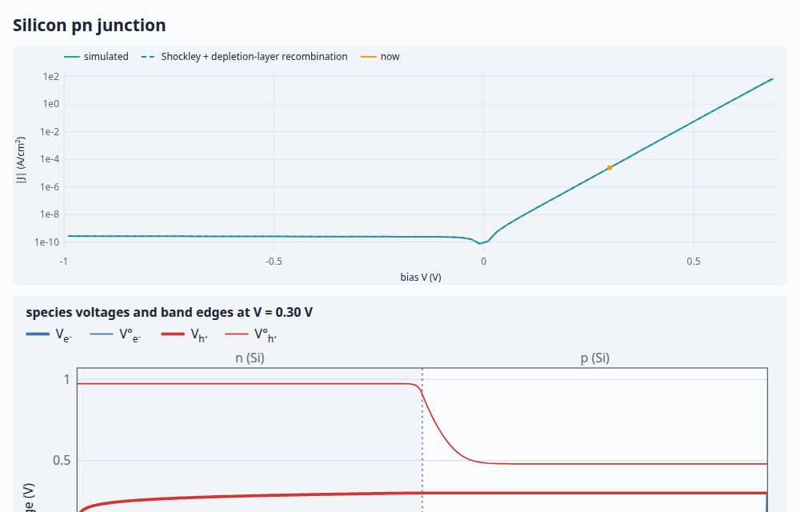](https://markblundeberg.github.io/driftlet/demos/pn.html) | [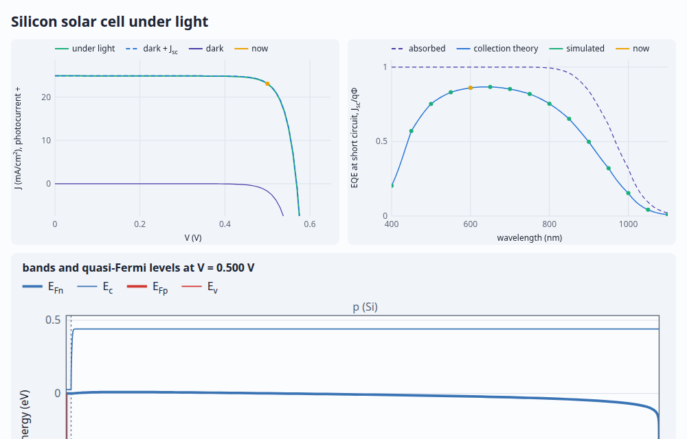](https://markblundeberg.github.io/driftlet/demos/solar.html) | [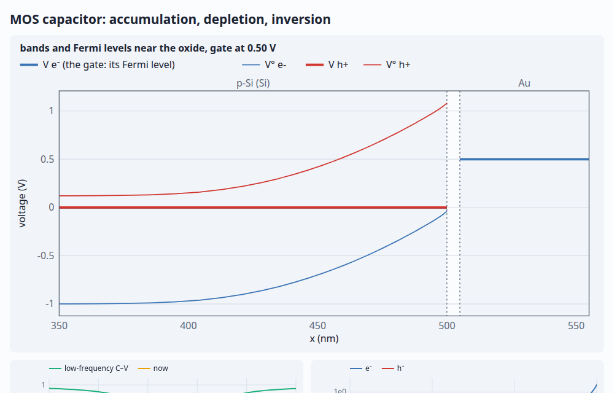](https://markblundeberg.github.io/driftlet/demos/mos.html) |
| **pn junction**: quasi-Fermi levels under bias; I–V against Shockley | **Solar cell**: J<sub>sc</sub> and V<sub>oc</sub> against collection theory | **MOS capacitor**: band bending; C–V against ideal theory |
| [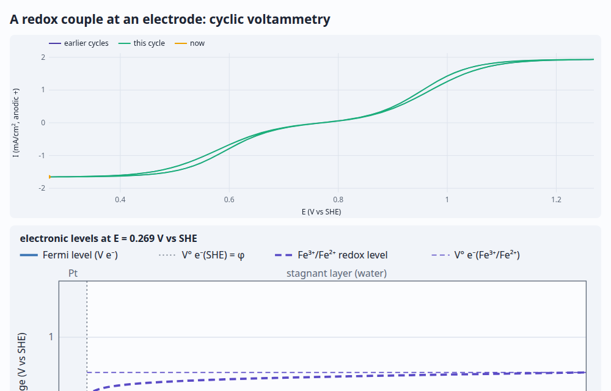](https://markblundeberg.github.io/driftlet/demos/redox.html) | [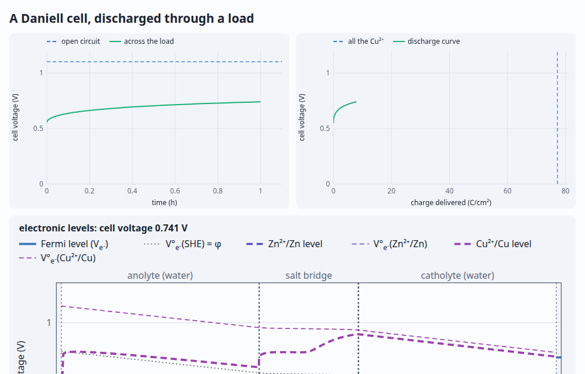](https://markblundeberg.github.io/driftlet/demos/daniell.html) | [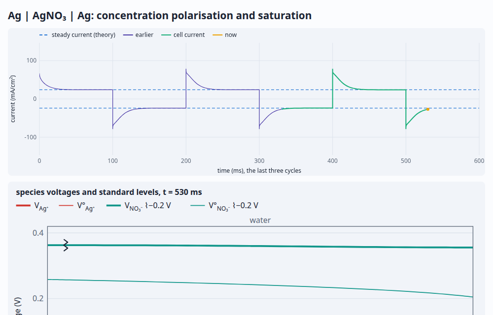](https://markblundeberg.github.io/driftlet/demos/saturation.html) |
| **Cyclic voltammetry**: a Fermi level against a redox level | **Daniell cell**: a real salt bridge, leaking, ion by ion | **Saturation**: Ag \| AgNO₃ \| Ag under a square wave, up to its limiting current |
| [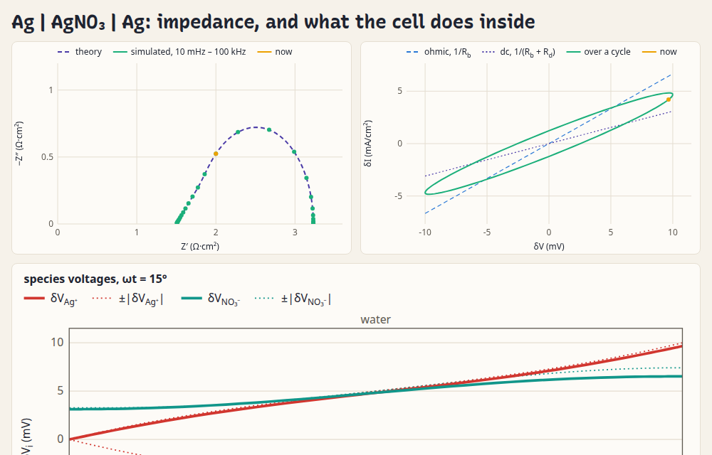](https://markblundeberg.github.io/driftlet/demos/impedance.html) | [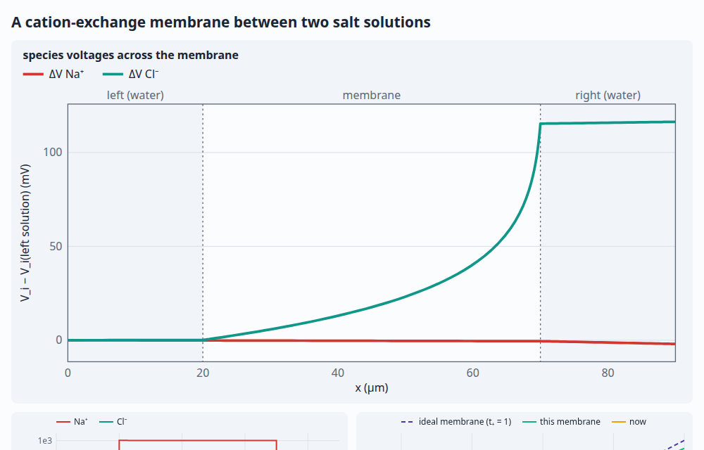](https://markblundeberg.github.io/driftlet/demos/membrane.html) | [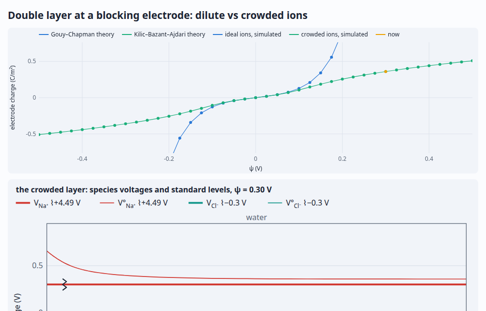](https://markblundeberg.github.io/driftlet/demos/double-layer.html) |
| **Impedance**: the Warburg arc, and the cell's small-signal response inside | **Ion-exchange membrane**: Donnan steps, ion by ion, against TMS theory | **Double layer**: dilute vs crowded ions, against closed forms |
| [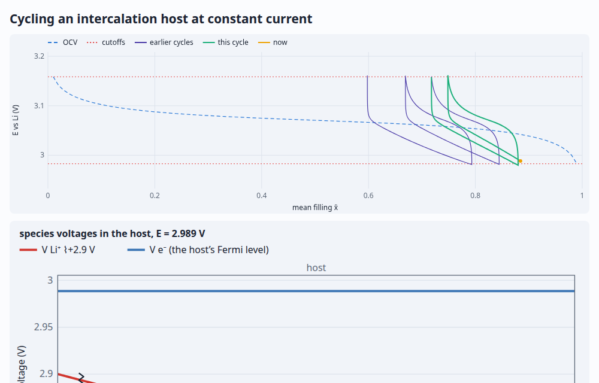](https://markblundeberg.github.io/driftlet/demos/insertion.html) | [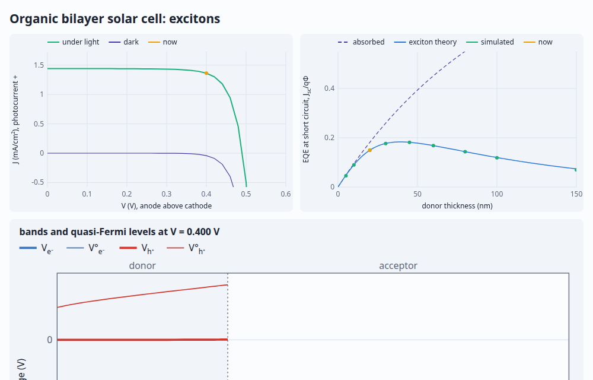](https://markblundeberg.github.io/driftlet/demos/organic.html) | [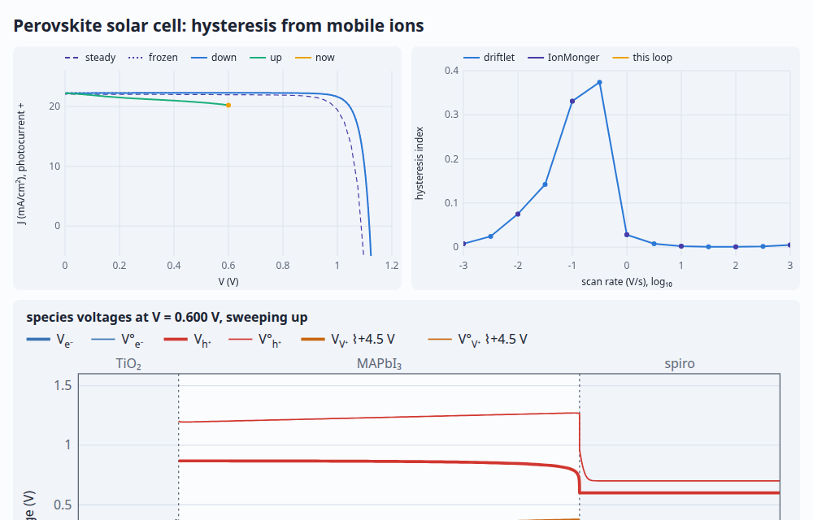](https://markblundeberg.github.io/driftlet/demos/perovskite.html) |
| **Intercalation host**: cycling between cutoffs against the OCV | **Organic solar cell**: excitons diffusing to a donor/acceptor interface, against theory | **Perovskite hysteresis**: mobile ions and scan rate, against IonMonger |
| [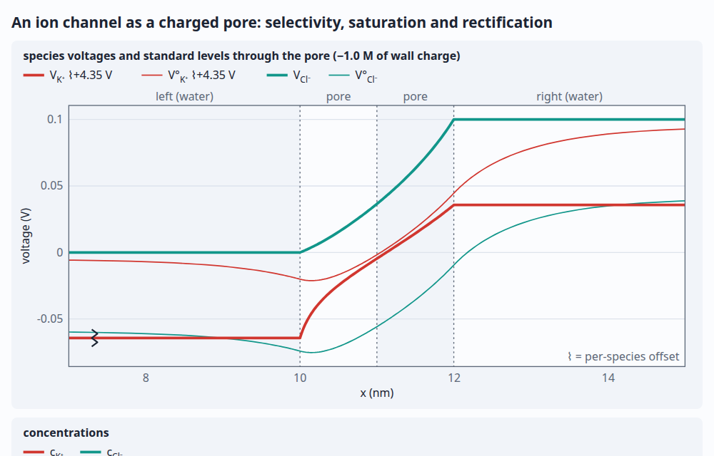](https://markblundeberg.github.io/driftlet/demos/channel.html) | [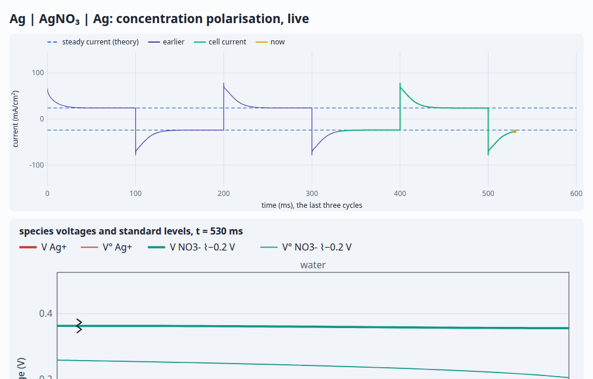](https://markblundeberg.github.io/driftlet/demos/cell.html) | [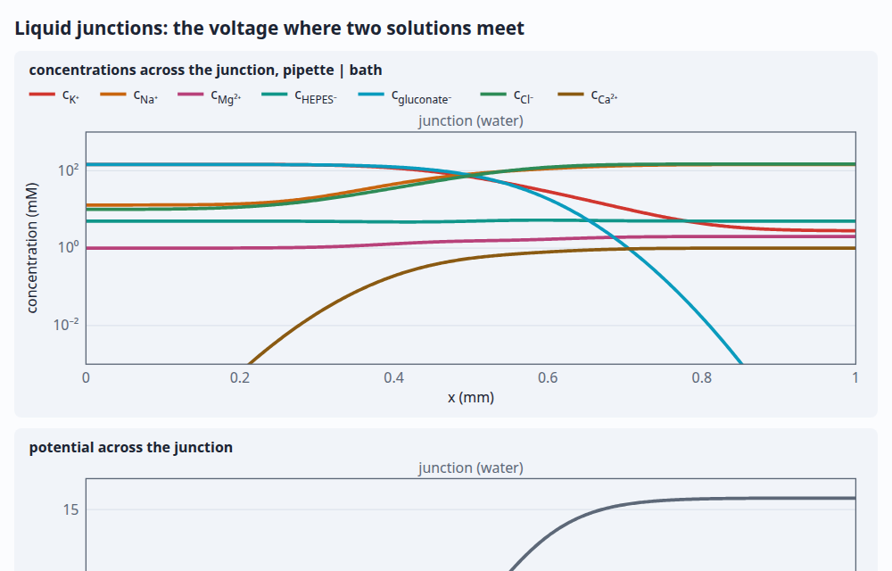](https://markblundeberg.github.io/driftlet/demos/junction.html) |
| **Charged nanochannel**: selectivity, overlapping Donnan layers and rectification, against Teorell–Meyer–Sievers | **Resting potential**: leaks and the Na⁺/K⁺ pump, against Mullins–Noda; the run-down to Donnan | **Liquid junctions**: a patch pipette's against Henderson, Planck and LJPcalc; a charged frit |

## How to think about it

driftlet insists on thermodynamically honest concepts ([conventions](docs/conventions.md)):

- **Everything you set or measure is an electrochemical potential μ̄** (or a difference of
  them). A bias sets Δμ̄ of electrons between terminals; a gate sets its metal's `μ̄_e⁻`. Nothing
  you set is an electrostatic potential.
- **φ is bookkeeping.** Each material's standard chemical potentials anchor its own φ, and φ
  jumps at every interface between different materials.
- **Band alignment is a property of each interface** and must be given explicitly: nothing is
  assumed by default. If vacuum-level estimates are all you have, helpers in `driftlet/kit`
  take an anchor and an offset per side (electron affinity, work function, absolute SHE
  potential, …) and return the alignment that lines up the vacuum levels. The
  [alignment guide](docs/alignment.md) covers the recipe and its caveats.
- The species voltage `V_i = μ̄_i / (z_i F)` and standard level `V°_i` are available as views,
  alongside redox levels: [reading level diagrams](docs/visualization.md) explains them.

A device is a line of **regions** (each a **material** plus a length, fixed charge and
initial composition), joined at **interfaces**, with a **contact** at each end. The contacts
and any internal **ports** are its **terminals**, each held at a voltage or driven by a
current. Supported physics:

- any mix of charged and neutral species; per-material diffusivities and standard potentials;
  species absent from some materials;
- ideal statistics by default, or per material: Fermi–Dirac (degenerate carriers), lattice
  gas (crowding, site filling), Redlich–Kister, Debye–Hückel, intercalation hosts described by
  their OCV curve, or your own function ([statistics](docs/statistics.md));
- Poisson electrostatics, or strictly neutral (ε = 0) materials such as macroscopic
  electrolytes;
- conductor regions (metals, fast ion conductors) with only their carrier's level and a
  conductivity: Schottky and MOS gates as regions, electrodes with reactions at their faces,
  bipolar electrodes;
- contacts as outside phases with known levels, joined by the same laws as internal faces:
  ohmic contacts, reversible electrodes, baths, pinned barriers, conductance links, gates and
  Stern layers;
- interfaces with explicit alignment, blocking, interface resistance, and Butler–Volmer
  reactions with participants on either side (electrode reactions, ion and electron transfer,
  mixed potentials), and a choice of electrostatic law (pinned, neutral, Helmholtz);
- bulk reactions with thermodynamically consistent mass action (recombination, water
  autoionisation, …);
- imposed flow (advection) and current-free eddy mixing;
- internal ports: reservoirs feeding a window of nodes, e.g. grounding a MOS channel;
- terminals held at a voltage, driven by a current (including open circuit) or behind a
  resistance, with piecewise-linear waveforms (cyclic voltammetry); reference electrodes and
  other internal terminals as ports; impedance at any terminal;
- steady states; transients by backward Euler, BDF2, or adaptive BDF2 with error control and
  frame budgets for animation; exact conservation bookkeeping;
- small-signal impedance spectra Z(f), with complex profiles.

## What it doesn't do

- **More than one dimension.** Planar 1D only, so no porous-electrode (P2D) models. For 2D/3D,
  see [ChargeTransport.jl](https://github.com/WIAS-PDELib/ChargeTransport.jl), TCAD tools or
  COMSOL.
- **Cross-diffusion.** Each species moves down its own μ̄ with its own D (the statistics can be
  non-ideal); there are no Stefan–Maxwell or Onsager cross terms beyond eddy mixing.
- **Heat and optics.** Temperature is uniform. Generation is a reaction, with Beer–Lambert
  absorption as its profile at most; there's no optical model (reflection, interference,
  photon recycling). For those, see
  [Driftfusion](https://github.com/barnesgroupICL/Driftfusion),
  [SIMsalabim](https://github.com/kostergroup/SIMsalabim) or
  [PyBaMM](https://github.com/pybamm-team/PyBaMM).
- **Field-dependent transport.** No high-field mobility, impact ionisation, field-enhanced
  dissociation (second Wien effect) or tunnelling.
- **Fitting.** It solves forward problems; parameter estimation is up to you.

How it works numerically is in [numerics](docs/numerics.md).

## Validation

Every physics feature is tested against analytic results (`npm test`, node's built-in runner).

| What | Checked against | Tolerance |
|---|---|---|
| Equilibrium of any device | μ̄ of every species flat; zero current | 1e-9 RT or better |
| Gouy–Chapman double layer | analytic charge and full nonlinear profile | 2e-3 |
| Debye screening (linear limit) | gate in series with `ε/λ_D` | 1e-3 |
| Donnan potential | analytic partition, between floating layers and real baths | 1e-8 |
| Heterointerfaces with unequal dipoles (A \| B \| A) | per-face analytic double-layer split | 3e-3 |
| Floating island | Gauss's law; conserved amounts through gate sweeps | 1e-12 |
| pn junction | exact built-in potential; depletion charge; short-diode J–V | 1e-12; 1%; 2e-3 |
| Long pn diode with recombination | Shockley J–V incl. depletion recombination | 2e-3 |
| Haynes–Shockley pulse | an injected hole packet's drift, spread and decay at the ambipolar μ*, D*, 1/τ*; nothing lost while it goes in | 2e-4; 1e-2; 2e-3 |
| A packet laid down as a `c0` profile | the same rates from a Gaussian at t = 0: μ*E t, σ₀² + 2D*t, e^(−t/τ*) | 3e-4; 1e-2; 1e-3 |
| Beer–Lambert photogeneration in an n⁺p cell | J_sc = qΦ∫αe^(−αx)η(x)dx with the emitter's, depletion layer's and base's collection, α from 1e3 to 1e7 /m on one coarse grid | 5e-4 (3e-3 in the emitter) |
| Organic bilayer: excitons | J_sc from excitons diffusing to the donor/acceptor interface (Beer–Lambert, a blocking anode, the splitting reaction's finite velocity); V_oc from charge-transfer detailed balance | 5e-4; 1e-6 V |
| SRH recombination | bulk: G = R_SRH(n, p) with n = N_D + p, midgap and shallow traps, low to high injection; at a face: zero in the dark, the law between the two edge nodes, every pair collected or recombined | 1e-6; 1e-9 |
| Perovskite J–V hysteresis, against IonMonger | an independent code (finite elements, Octave): mobile iodide vacancies, interface SRH, scans from 1 mV/s to 1 kV/s — hysteresis index, P_max, V_oc, the whole loop (as current where it's gentle, as a voltage offset near V_oc, where it falls at up to 1100 mA/cm² per volt) | 1.5e-3; 0.05 mW/cm²; 2 mV; 0.03 mA/cm² and 1 mV (0.010 and 0.31 mV found) |
| Illuminated long pn diode | `J_sc = qG(L_n + L_p + W)` from a cold start; superposition at low injection | 5e-3; 1e-2 |
| Schottky barrier (metal region \| n-Si) | surface density from the alignment; depletion charge | 5e-3; 2% |
| Charged pore or nanochannel (resolved Donnan layers at each mouth) | conductance against salt, down to its plateau, as Teorell–Meyer–Sievers in a long pore (short ones short by end layers ∝ 1/L); the zero-current voltage across a salt gradient; a symmetric pore's I–V odd, rectification with charge on one side or bipolar | 1%; 5e-3 to 1e-4; 1e-9 |
| Cell membrane (a capacitive face with permeabilities) | GHK resting potential (neutral or resolved solutions) and current–voltage curve; the same as a resolved 5 nm lipid layer; charging at I/C; with the Na⁺/K⁺ pump in a closed cell, Mullins–Noda, the static head 3Δμ̄_Na − 2Δμ̄_K = ΔG_ATP, and Donnan with the pump off | 1e-5 V; 3e-3; 2e-5 V; 1%; 1e-9 |
| Liquid junctions in mixtures | Henderson's formula against JPCalc's published values; driftlet's steady junction against Planck by shooting and the stationary Nernst–Planck codes LJPcalc and JLJP, a patch pipette's K-gluconate among them; a free-diffusion junction constant in time, between the two | 0.015 mV; 2e-4 and 0.02 mV; 5e-3 mV |
| Liquid junction, open circuit | cell EMF 2t₊(RT/F) ln(c₁/c₂); Planck diffusion potential | 1e-4 |
| Salt diffusion mode from a `c0` profile | c̄ + a·sin(πx/2L) decaying at π²D/4L², D = 2D₊D₋/(D₊ + D₋) | 2e-5 |
| Concentration polarization | `i = i_lim tanh(V/4V_T)`, incl. galvanostatic and load modes | 2e-4 |
| Butler–Volmer electrode | Nernst equilibrium; mixed kinetic/diffusion closed form | 5e-4 |
| Redox couple between inert electrodes | Nernst level of Fe³⁺/Fe²⁺; the couple's total conserved at equilibrium and under current | 1e-9; 1e-10 |
| Interface conductance and ion transfer | series 1/G; BV rate law at the interface state | 1e-4; 1e-8 |
| Mass action | `c(H⁺)c(OH⁻) = K_w` from standard potentials; moiety conservation | 1e-9 |
| Second law | free energy in through the terminals (Σ N μ̄ over every species) equals the dissipation, every term ≥ 0: a pn diode, an open-circuit junction running on chemical input alone, electrodes with a bipolar plate, a port and a contact behind conductances | 1e-10 |
| Transients | RC charging of a gated island; water relaxation rate | 1%; 2e-3 |
| Time integration | BE first order, BDF2 second order; adaptive error control | ratios 2, 4 |
| Advection and eddy mixing | exact convection–diffusion profile; `D + D_mix`; junction EMF unchanged by mixing | 1e-12; 1e-12; 1e-5 |
| Metal regions | ohmic; Schottky face and MOS gate equal their contact forms; Ag \| AgNO₃ \| Ag with metal electrodes; bipolar electrode at V/2 | 1e-12; 1e-9; 1e-9; 1e-9 |
| Internal ports | transmission line σV tanh(L/λ)/λ (O(h²)); held level; MOS low-frequency C–V with a grounded channel | 1e-4; 1e-9; 2e-3 |
| Impedance | Macdonald blocking-electrode spectrum, 100 Hz–1 GHz; finite-length Warburg (Ag \| AgNO₃ \| Ag); DC limit = differential resistance | 3e-4; 3e-5; 1e-6 |
| Conservation | per step, and against time-integrated contact fluxes | 1e-11 relative |
| Strictly neutral limit (ε = 0) | Planck EMF; polarization with no overlimiting; Donnan at neutral faces | 1e-5; 1e-4; 1e-9 |
| Fermi–Dirac statistics | `𝓕_{±1/2}` vs quadrature; degenerate bulk; accumulation charge via `𝓕_{3/2}` | 1e-13; 1e-12; 1e-3 |
| Crowded double layer (lattice gas) | Kilic–Bazant–Ajdari charge, up to `ψ = 40 V_T`; custom function reproduces it | 5e-4; 1e-10 |
| Non-ideal transport | steady flux −(D/L)ΔP of the grand potential (lattice exact, Redlich–Kister O(h²)) | 1e-12; 1e-4 |
| Debye–Hückel | junction EMF 2t₊(RT/F) ln(a₁/a₂) with activities | 1e-6 |
| Data library | ion μ° against the electrochemical series and `K_w`; D against limiting conductivities; band data against `n_i` | 10 mV; 0.5%; 15% |
| Intercalation host (OCV) | composition vs table and isotherm; chemical diffusion flux and relaxation rate | 1e-12; 1e-5; 1e-4 |

## Performance

`npm run bench` runs typical interactive workloads and compares them with a committed
baseline. Matrix factorisations (≈ Newton iterations) and block work are deterministic and
checked in CI; times are from a desktop Ryzen 7600X in Node 22:

| Task | Time | Factorisations |
|---|---|---|
| Linear solve, 300 nodes × 7 unknowns (factor + solve) | 0.4 ms | 1 |
| pn diode (264 nodes): cold equilibrium | 2 ms | 9 |
| pn diode: I–V sweep 0 → 0.6 V, 31 points | 31 ms | 137 |
| pn diode: warm jump from +0.4 V to −1 V | 7 ms | 51 |
| pn diode: adaptive transient, 0 → 0.5 V, 100 ns | 150 ms | 1026 |
| pn diode: impedance at 20 frequencies | 8 ms | 21 |
| MOS with a metal gate: C–V sweep, 26 points | 11 ms | 126 |
| n-Si \| KCl (4 species, 3 unknowns per node): Mott–Schottky sweep, 31 points | 29 ms | 156 |
| n-Si \| KCl: impedance at 20 frequencies | 10 ms | 21 |
| Ag \| AgNO₃ \| Ag with double layers: sweep 0 → 0.1 V, 21 points | 12 ms | 81 |
| Ag \| AgNO₃ \| Ag, neutral: adaptive transient over 1 s | 29 ms | 287 |
| Silver electrodes with a bipolar plate: sweep 0 → 1 V, 11 points | 27 ms | 63 |

The library has no dependencies and does no DOM access, so it runs in a Web Worker. (A device
definition is plain data and can be posted to a worker. Devices using custom-function
statistics can't be, and must be built inside the worker.)

## Development

No dependencies. Tests use node's built-in runner (Node ≥ 22):

```sh
npm test         # the validation suite
npm run bench    # typical workloads against bench/baseline.json (--save to update it)
npm run types    # TypeScript declarations from the JSDoc, into types/ (fetches TypeScript via npx)
npm run smoke    # every demo in headless Chrome, every control to its extremes (CHROME=… to choose)
npm run shots    # retake the demos' screenshots, each caught at a set state (tools/shots.js)
```

Design notes and plans: [numerics](docs/numerics.md), [conventions](docs/conventions.md),
[statistics](docs/statistics.md), [the kit](docs/kit.md), [reading level diagrams](docs/visualization.md),
[data](docs/data.md), [roadmap](ROADMAP.md).

## Licence

[0BSD](LICENSE): do anything you like with it.
