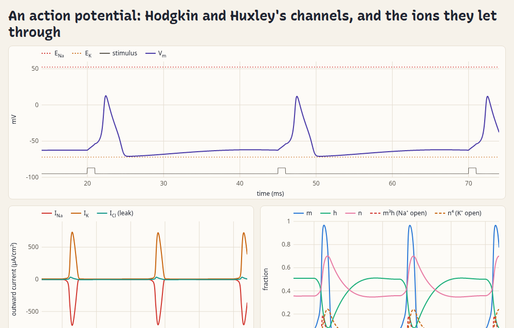
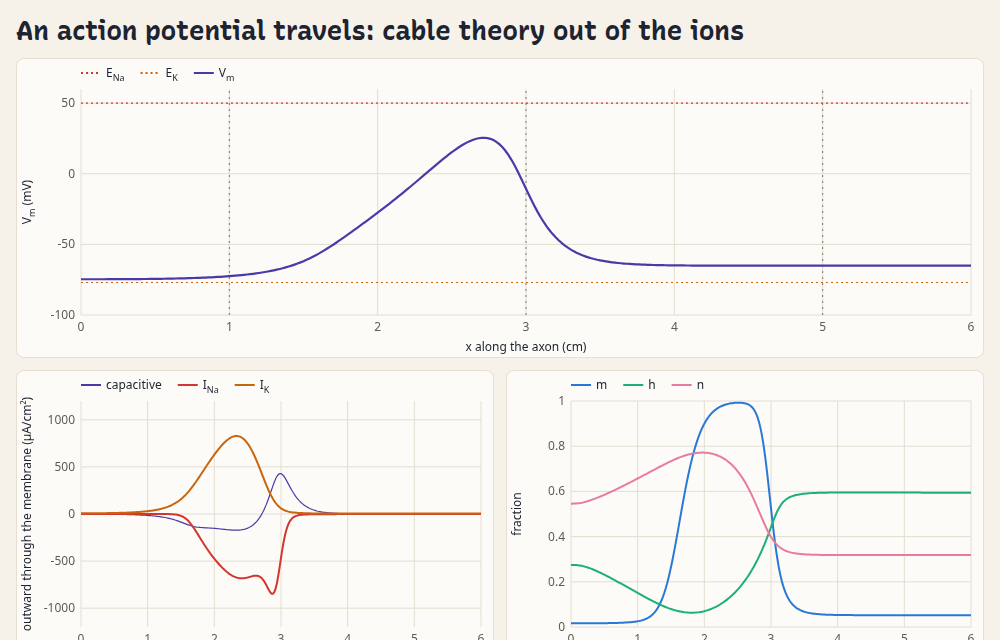
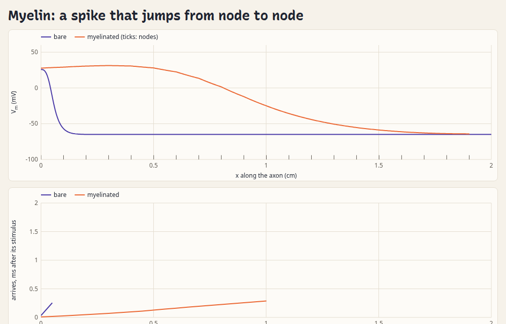

<h1>
  <picture>
    <source media="(prefers-color-scheme: dark)" srcset="https://markblundeberg.github.io/driftlet/docs/logo-dark.svg">
    
  </picture>
</h1>

[](https://github.com/markblundeberg/driftlet/actions/workflows/test.yml)
[](https://www.npmjs.com/package/driftlet)

**driftlet simulates charged species moving through one-dimensional devices**: semiconductor
junctions and solar cells, electrochemical cells and batteries, double layers, membranes and
nerves. It's a small JavaScript library with no dependencies, fast enough to solve live in a
web page as you drag a slider.

[Live demos](https://markblundeberg.github.io/driftlet/demos/) · [npm](https://www.npmjs.com/package/driftlet) ·
[reading level diagrams](docs/visualization.md) · [device reference](docs/device.md) ·
[agent guide](llms.txt)

**One kind of physics.** Those look like different subjects, but underneath they're the same
one. Each is a cast of species (electrons, holes, ions, neutral molecules) that drift and
diffuse, each down its own electrochemical potential; their charge sets the electric field,
reactions turn one into another, and at interfaces they pass from one material to the next or
are stopped. A pn junction is electrons and holes in silicon. A silver electrode is Ag⁺ and NO₃⁻
in water, with Ag⁺ trading places with the metal's electrons at its surface. A nerve is Na⁺ and
K⁺ on either side of a membrane, crossing it through channels that open with voltage, and the
impulse travels along the fibre on the current those same ions carry inside it. Even the levels
each field draws are one quantity: a quasi-Fermi level, an electrode potential and a Nernst
potential are each a species' electrochemical potential. driftlet solves that one problem, in
steady state, in time and as small-signal impedance, so a new field is mostly a new cast, and
the work that makes it reliable in one field makes it reliable in the others.

**Built to be relied on.** A drift–diffusion solver that handles a textbook pn junction is a
weekend's work; one that keeps working on the devices people actually build is not. In real
devices concentrations span 30 orders of magnitude and double layers are a millionth of the
device's length, and there a plain Newton solver fails or, worse, quietly converges to a wrong
answer. driftlet is tested two ways: every physics feature against an analytic result or an independent code, and
thousands of randomly generated devices (junctions, MOS capacitors, solar cells, electrolyte
cells, electrodes) put through cold solves, sweeps, transients and impedance, every result
checked. A solve that fails reports it, with what went wrong where it can tell.
[How far to trust it](docs/reliability.md) has the details, the numbers and the known limits.

**Status: 0.x.** Released on npm and used by the demos, but the API may still change between
minor versions.

## Install

```sh
npm install driftlet
```

```js nocheck
import { Device, units } from 'driftlet';       // the solver
import { build, layer, ohmic } from 'driftlet/kit'; // helpers that write definitions, data, live demos
import { bandDiagram } from 'driftlet/plot';    // a level diagram as an SVG string
```

Or straight from a CDN in a page, pinned to a version:
`https://cdn.jsdelivr.net/npm/driftlet@0.16.2/src/index.js` (and `src/kit.js`, `src/plot.js`).
TypeScript declarations ship in the package. Writing a demo with an LLM agent? Point it at
[`llms.txt`](llms.txt).

## A semiconductor junction

A silicon pn junction with ohmic contacts, at equilibrium and then under forward bias. A device
is plain data; `build()` from `driftlet/kit` writes it from the stack as it's drawn, with a
[data library](docs/data.md) for the material:

```js
import { Device, units } from 'driftlet';
import { build, layer, ohmic, semiconductor } from 'driftlet/kit';

const dev = new Device(
  build({
    T: 300,
    library: [semiconductor('Si')], // e⁻ and h⁺ with Sze's band data at 300 K
    stack: [
      ohmic(0), // e⁻ and h⁺ in equilibrium with a metal, the terminal at 0 V
      layer('Si', units.um(2), { name: 'n', donors: units.perCm3(1e17) }),
      layer('Si', units.um(2), { name: 'p', acceptors: units.perCm3(1e16) }),
      ohmic(0),
    ],
    grid: { hmin: units.nm(0.5), hmax: units.nm(20) },
  }),
);

const eq = dev.solve();
console.log('built-in potential (V):', eq.phi[0] - eq.phi[eq.phi.length - 1]); // ≈ 0.795

dev.set({ contacts: { right: { V: 0.4 } } }); // p side at +0.4 V: forward bias
const on = dev.solve(); // warm-started from the previous solution
console.log('current (A/m²):', on.current); // negative: it flows toward −x, from p to n
```

## An electrochemical cell

Silver nitrate between two silver electrodes, as a macroscopic (strictly neutral) electrolyte.
A reversible electrode is a contact whose terminal species is the ion it exchanges: Ag⁺ in
equilibrium with the metal, NO₃⁻ blocked. Polarized, the cell's current saturates at the
limiting current, `i_lim = 4FD₊c₀/L` for this binary salt:

```js
import { Device, FARADAY } from 'driftlet';
import { build, layer, aqueous } from 'driftlet/kit';

const L = 100e-6, c0 = 10; // m, mol/m³ (10 mM)
// Ag⁺ + e⁻ ⇌ Ag at the metal: V is the voltage of Ag⁺ there, i.e. the electrode potential.
const silver = (V) => ({ V, terminal: 'Ag+', species: { 'Ag+': 'equilibrium', 'NO3-': 'blocked' }, phi: 'bulk' });
const dev = new Device(
  build({
    library: [aqueous(['Ag+', 'NO3-'], { epsr: 0 })], // epsr 0: no double layers resolved
    // Ag⁺ reaches the contacts and takes their level; NO₃⁻ doesn't, so it needs its amount.
    stack: [silver(0), layer('water', L, { c0: { 'NO3-': c0 } }), silver(0)],
    grid: { hmin: 10e-9, hmax: 2e-6 }, // graded: fine where Ag⁺ depletes at the electrode
  }),
);
const iLim = (4 * FARADAY * 1.648e-9 * c0) / L;
for (const V of [0.05, 0.1, 0.2, 0.4]) {
  dev.set({ contacts: { right: { V } } });
  const sol = dev.solve();
  // V > 0 raises Ag⁺'s level on the right: silver dissolves there and plates on the left, so the
  // current flows toward −x.
  console.log(`${V} V: I/i_lim = ${(-sol.current / iLim).toFixed(4)}`); // ≈ tanh(V/4V_T): 0.451, 0.750, 0.961, 0.999
}
```

Solutions are plain objects of `Float64Array`s, ready to plot (fresh arrays from every solve):
`x`, `phi`, and per species `c`, `mu` (electrochemical potential μ̄), `muStd` (standard level)
and the voltage views `V`, `Vstd`. They also carry the terminals' voltages and currents, fluxes,
conservation bookkeeping and warnings; see [the device reference](docs/device.md). The
[kit](docs/kit.md) adds reactions written as equations (`'Ag+ + e- = Ag(s)'`), redox levels,
level diagrams, slider demos, a transient recorder, `describe()` (which flags likely unit slips),
`check()` (a solution's ledgers and a grid-convergence check),
and curated devices with reference results: IonMonger's perovskite cell, with its J–V scans.

## Demos

Live pages in [`demos/`](demos/), each building its device with `driftlet/kit`, solving it in the
browser as you move the controls, and showing its whole script as a worked example. Most draw the
closed-form theory alongside, as a check. They're live at
[markblundeberg.github.io/driftlet/demos](https://markblundeberg.github.io/driftlet/demos/); to run
them locally, serve the repository root (e.g. `python3 -m http.server`) and open `/demos/`.

| | | |
|---|---|---|
| [](https://markblundeberg.github.io/driftlet/demos/pn.html) | [](https://markblundeberg.github.io/driftlet/demos/solar.html) | [](https://markblundeberg.github.io/driftlet/demos/mos.html) |
| **pn junction**: quasi-Fermi levels under bias; I–V against Shockley | **Solar cell**: J<sub>sc</sub> and V<sub>oc</sub> against collection theory | **MOS capacitor**: band bending; C–V at any frequency, low to high |
| [](https://markblundeberg.github.io/driftlet/demos/redox.html) | [](https://markblundeberg.github.io/driftlet/demos/daniell.html) | [](https://markblundeberg.github.io/driftlet/demos/saturation.html) |
| **Cyclic voltammetry**: a Fermi level against a redox level | **Daniell cell**: a real salt bridge, leaking, ion by ion | **Saturation**: Ag \| AgNO₃ \| Ag up to its limiting current, and a thin-film transistor pinching off, against the charge-sheet model |
| [](https://markblundeberg.github.io/driftlet/demos/impedance.html) | [](https://markblundeberg.github.io/driftlet/demos/membrane.html) | [](https://markblundeberg.github.io/driftlet/demos/double-layer.html) |
| **Impedance**: the Warburg arc, and the cell's small-signal response inside | **Ion-exchange membrane**: Donnan steps, ion by ion, against TMS theory | **Double layer**: dilute vs crowded ions, against closed forms |
| [](https://markblundeberg.github.io/driftlet/demos/insertion.html) | [](https://markblundeberg.github.io/driftlet/demos/organic.html) | [](https://markblundeberg.github.io/driftlet/demos/perovskite.html) |
| **Intercalation host**: cycling between cutoffs against the OCV | **Organic solar cell**: excitons diffusing to a donor/acceptor interface, against theory | **Perovskite hysteresis**: mobile ions and scan rate, against IonMonger |
| [](https://markblundeberg.github.io/driftlet/demos/channel.html) | [](https://markblundeberg.github.io/driftlet/demos/cell.html) | [](https://markblundeberg.github.io/driftlet/demos/junction.html) |
| **Charged nanochannel**: selectivity, overlapping Donnan layers and rectification, against Teorell–Meyer–Sievers | **Resting potential**: leaks and the Na⁺/K⁺ pump, against Mullins–Noda; the run-down to Donnan | **Liquid junctions**: a patch pipette's against Henderson, Planck and LJPcalc; a charged frit |
| [](https://markblundeberg.github.io/driftlet/demos/axon.html) | [](https://markblundeberg.github.io/driftlet/demos/propagation.html) | [](https://markblundeberg.github.io/driftlet/demos/myelin.html) |
| **Action potential**: Hodgkin and Huxley's gated channels, each ion's driving force through the spike, against the HH equations | **Propagation**: a spike travelling along an axon at HH's speed, out of the ions' drift; which ions carry it | **Myelin**: saltatory conduction, node to node, against a compartmental cable; a race with a bare axon |

## Is it for your problem?

The same equations go by different names in different fields. If your problem is one-dimensional
(planar, or radial: spheres and cylinders, or any cross-section varying along x), it's probably here:

| If you work on | you may call it | start from |
|---|---|---|
| Semiconductor devices | drift–diffusion, van Roosbroeck, quasi-Fermi levels, Scharfetter–Gummel; pn, Schottky, MOS, heterojunctions, thin-film transistors | the [first example](#a-semiconductor-junction); [pn](https://markblundeberg.github.io/driftlet/demos/pn.html), [MOS](https://markblundeberg.github.io/driftlet/demos/mos.html) and [transistor](https://markblundeberg.github.io/driftlet/demos/saturation.html#transistor) demos |
| Solar cells | photogeneration, Beer–Lambert, radiative and SRH recombination, excitons, mobile ions | [solar](https://markblundeberg.github.io/driftlet/demos/solar.html), [organic](https://markblundeberg.github.io/driftlet/demos/organic.html) and [perovskite](https://markblundeberg.github.io/driftlet/demos/perovskite.html) demos |
| Electrochemistry, corrosion | Nernst–Planck, concentration polarization, limiting current, Butler–Volmer, Warburg, cyclic voltammetry, salt bridges, liquid junctions, mixed potentials | the [second example](#an-electrochemical-cell); [cyclic voltammetry](https://markblundeberg.github.io/driftlet/demos/redox.html), [Daniell cell](https://markblundeberg.github.io/driftlet/demos/daniell.html), [limiting current](https://markblundeberg.github.io/driftlet/demos/saturation.html), [impedance](https://markblundeberg.github.io/driftlet/demos/impedance.html) and [liquid-junction](https://markblundeberg.github.io/driftlet/demos/junction.html) demos |
| Batteries, intercalation | OCV, insertion hosts, chemical diffusion | [insertion](https://markblundeberg.github.io/driftlet/demos/insertion.html) demo |
| Double layers, colloids | Poisson–Boltzmann, Gouy–Chapman–Stern, Debye screening, crowding (Bikerman) | [double-layer](https://markblundeberg.github.io/driftlet/demos/double-layer.html) demo |
| Membranes, nanofluidics | Donnan, ion exchange, Teorell–Meyer–Sievers, charged nanochannels and pores | [membrane](https://markblundeberg.github.io/driftlet/demos/membrane.html) and [nanochannel](https://markblundeberg.github.io/driftlet/demos/channel.html) demos |
| Solid-state ionics | mixed ionic–electronic conduction, defect chemistry, mobile ions | [`statistics`](test/statistics.test.js) and [`reactions`](test/reactions.test.js) tests |
| Cell physiology, neuroscience | resting potential, Nernst, Goldman–Hodgkin–Katz, the Na⁺/K⁺ pump, patch pipettes, Hodgkin–Huxley, action potentials, the cable equation, myelin | [resting-potential](https://markblundeberg.github.io/driftlet/demos/cell.html), [action-potential](https://markblundeberg.github.io/driftlet/demos/axon.html), [propagation](https://markblundeberg.github.io/driftlet/demos/propagation.html) and [myelin](https://markblundeberg.github.io/driftlet/demos/myelin.html) demos |

The tests are worked setups, each with its analytic check, so they double as recipes; the
[validation table](docs/reliability.md#the-validation-table) lists them all.

## How to think about it

driftlet insists on thermodynamically honest concepts ([conventions](docs/conventions.md)):

- **Everything you set or measure is an electrochemical potential μ̄** (or a difference of
  them). A bias sets Δμ̄ of electrons between terminals; a gate sets its metal's `μ̄_e⁻`. Nothing
  you set is an electrostatic potential.
- **φ is bookkeeping.** Each material's standard chemical potentials anchor its own φ, and φ
  jumps at every interface between different materials.
- **Band alignment is a property of each interface** and must be given explicitly: nothing is
  assumed by default. If vacuum-level estimates are all you have, helpers in `driftlet/kit`
  take an anchor and an offset per side (electron affinity, work function, absolute SHE
  potential, …) and return the alignment that lines up the vacuum levels. The
  [alignment guide](docs/alignment.md) covers the recipe and its caveats.
- The species voltage `V_i = μ̄_i / (z_i F)` and standard level `V°_i` are available as views,
  alongside redox levels: [reading level diagrams](docs/visualization.md) explains them.

## What it does

A device is a line of **regions** (each a **material** plus a length, fixed charge and
initial composition), joined at **interfaces**, with a **contact** at each end. The contacts
and any internal **ports** are its **terminals**, each held at a voltage or driven by a
current. Within that:

- any mix of charged and neutral species; per-material diffusivities and standard potentials;
  species absent from some materials;
- ideal statistics by default, or per material: Fermi–Dirac (degenerate carriers), lattice
  gas (crowding, site filling), Redlich–Kister, Debye–Hückel, intercalation hosts described by
  their OCV curve, or your own function ([statistics](docs/statistics.md));
- Poisson electrostatics, or strictly neutral (ε = 0) materials such as macroscopic
  electrolytes;
- conductor regions (metals, fast ion conductors) with only their carrier's level and a
  conductivity: Schottky and MOS gates as regions, electrodes with reactions at their faces,
  bipolar electrodes;
- contacts as outside phases with known levels, joined by the same laws as internal faces:
  ohmic contacts, reversible electrodes, baths, pinned barriers, conductance links, surface
  velocities (thermionic emission over a Schottky barrier, surface recombination), gates and
  Stern layers;
- interfaces with explicit alignment, blocking, interface resistance, and Butler–Volmer
  reactions with participants on either side (electrode reactions, ion and electron transfer,
  mixed potentials), and a choice of electrostatic law (pinned, neutral, Helmholtz);
- membranes as capacitive faces with ion permeabilities (Goldman–Hodgkin–Katz), pumps as
  reactions on them and voltage-gated channels with Hodgkin–Huxley kinetics; or spread along a
  region through a port, as an axon's wall;
- bulk reactions with thermodynamically consistent mass action (recombination, water
  autoionisation, …);
- imposed flow (advection) and current-free eddy mixing;
- internal ports: reservoirs feeding a window of nodes, e.g. grounding a MOS channel;
- terminals held at a voltage, driven by a current (including open circuit) or behind a
  resistance, with piecewise-linear waveforms (cyclic voltammetry); reference electrodes and
  other internal terminals as ports; impedance at any terminal;
- steady states; transients by backward Euler, BDF2, or adaptive BDF2 with error control and
  frame budgets for animation; exact conservation bookkeeping;
- small-signal impedance spectra Z(f), with complex profiles.

## What it doesn't do

- **More than one dimension.** 1D only: planar, or a cross-section varying along x (spheres,
  cylinders, a thinning film), so no porous electrodes with diffusion inside their particles
  (P2D models). For 2D/3D,
  see [ChargeTransport.jl](https://github.com/WIAS-PDELib/ChargeTransport.jl), TCAD tools or
  COMSOL.
- **Cross-diffusion.** Each species moves down its own μ̄ with its own D (the statistics can be
  non-ideal); there are no Stefan–Maxwell or Onsager cross terms beyond eddy mixing.
- **Heat and optics.** Temperature is uniform. Generation is a reaction, with Beer–Lambert
  absorption as its profile at most; there's no optical model (reflection, interference,
  photon recycling). For those, see
  [Driftfusion](https://github.com/barnesgroupICL/Driftfusion),
  [SIMsalabim](https://github.com/kostergroup/SIMsalabim) or
  [PyBaMM](https://github.com/pybamm-team/PyBaMM).
- **Field-dependent transport.** No high-field mobility, impact ionisation, field-enhanced
  dissociation (second Wien effect) or tunnelling.
- **Fitting.** It solves forward problems; parameter estimation is up to you.

How it works numerically is in [numerics](docs/numerics.md).

## Validation

Every physics feature lands with a test against an analytic result, or against an independent
code where there isn't one: over 300 tests (`npm test`), from Shockley's diode equation and the
Gouy–Chapman double layer to Hodgkin and Huxley's conduction velocity, and against IonMonger,
JPCalc, LJPcalc and JLJP. [How far to trust it](docs/reliability.md) lists every check with its
tolerance, alongside the random-device stress tests and the known limits.

## Performance

`npm run bench` runs typical interactive workloads and compares them with a committed
baseline. Matrix factorisations (≈ Newton iterations) and block work are deterministic and
checked in CI; times are from a desktop Ryzen 7600X in Node 22:

| Task | Time | Factorisations |
|---|---|---|
| Linear solve, 300 nodes × 7 unknowns (factor + solve) | 0.4 ms | 1 |
| pn diode (264 nodes): cold equilibrium | 3 ms | 9 |
| pn diode: I–V sweep 0 → 0.6 V, 31 points | 29 ms | 137 |
| pn diode: warm jump from +0.4 V to −1 V | 8 ms | 51 |
| pn diode: adaptive transient, 0 → 0.5 V, 100 ns | 165 ms | 926 |
| pn diode: impedance at 20 frequencies | 14 ms | 21 |
| MOS with a metal gate: C–V sweep, 26 points | 9 ms | 126 |
| n-Si \| KCl (4 species, 3 unknowns per node): Mott–Schottky sweep, 31 points | 36 ms | 156 |
| n-Si \| KCl: impedance at 20 frequencies | 16 ms | 21 |
| Ag \| AgNO₃ \| Ag with double layers: sweep 0 → 0.1 V, 21 points | 12 ms | 81 |
| Ag \| AgNO₃ \| Ag, neutral: adaptive transient over 1 s | 24 ms | 186 |
| Silver electrodes with a bipolar plate: sweep 0 → 1 V, 11 points | 25 ms | 54 |

The library has no dependencies and does no DOM access, so it runs in a Web Worker. (A device
definition is plain data and can be posted to a worker. Devices using custom-function
statistics can't be, and must be built inside the worker.)

## Development

No dependencies. Tests use node's built-in runner (Node ≥ 22):

```sh
npm test         # the validation suite
npm run bench    # typical workloads against bench/baseline.json (--save to update it)
npm run stress   # random devices, every result checked (--n 500 for more; see docs/reliability.md)
npm run hard     # the corpus of once-hard cases against bench/hard.json
npm run types    # TypeScript declarations from the JSDoc, into types/ (fetches TypeScript via npx)
npm run smoke    # every demo in headless Chrome, every control to its extremes (CHROME=… to choose)
npm run shots    # retake the demos' screenshots, each caught at a set state (tools/shots.js)
```

Design notes and plans: [reliability](docs/reliability.md), [numerics](docs/numerics.md), [conventions](docs/conventions.md),
[statistics](docs/statistics.md), [the kit](docs/kit.md), [reading level diagrams](docs/visualization.md),
[data](docs/data.md), [roadmap](ROADMAP.md).

## Licence

[0BSD](LICENSE): do anything you like with it.
